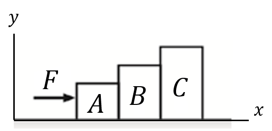
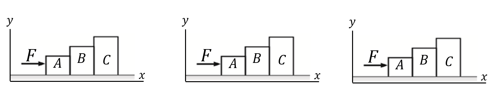
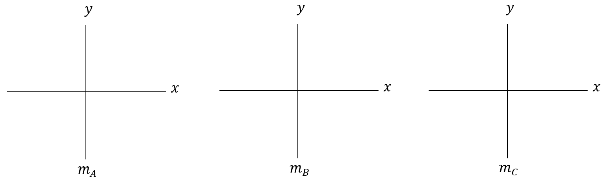

# {{ params_vars_title }}
Three blocks with masses $m_A = $ {{ params.m_A }} $\rm{kg}$, $m_B = $ {{ params.m_B }} $\rm{kg}$, and $m_C = $ {{ params.m_C }} $\rm{kg}$ are lined up in a row on a frictionless table. All three blocks are pushed forward by a force applied to block $A$ as shown in the figure ($F\_\text{on A} = F =$ {{ params_F }} $\rm{N}$). We would like to determine the force block $B$ exerts on blocks $A$ and $C$.

## Part 1

Draw a closed line around each of the three systems of interest (on the following figure) and show the environment, i.e., objects outside of the system that affect or exert forces on the system. Upload your file as a PDF named "systems.pdf".

### Answer Section

File upload box will be shown here.

## Part 2

What information is known?

### Answer Section

Select all the choices that apply.

Note: You will be awarded full marks only if you select all the correct choices and none of the incorrect choices. Choosing incorrect choices as well as not choosing correct choices will result in deductions.

- {{ params_part2_ans1_value}}
- {{ params_part2_ans2_value}}
- {{ params_part2_ans3_value}}
- {{ params_part2_ans4_value}}
- {{ params_part2_ans5_value}}
- {{ params_part2_ans6_value}}

## Part 3

What are the unknowns?

### Answer Section

Select all the choices that apply.

Note: You will be awarded full marks only if you select all the correct choices and none of the incorrect choices. Choosing incorrect choices as well as not choosing correct choices will result in deductions.

- {{ params_part3_ans1_value}}
- {{ params_part3_ans2_value}}
- {{ params_part3_ans3_value}}
- {{ params_part3_ans4_value}}
- {{ params_part3_ans5_value}}
- {{ params_part3_ans6_value}}

## Part 4

Draw a free body diagram for each individual masse and connect the action/reaction force pairs with dashed lines. Also remember to show the net forces. Upload your file as a PDF named "fbd.pdf".

### Answer Section

File upload box will be shown here.

## Part 5

Apply Newton's 2nd law to block $A$ along the x-axis.

Let $a$ be the acceleration.

Use the following table as a reference for each variable. Note that it may not be necessary to use every variable.

| For $\quad \quad$       | Use   |
|-------------------------|-------|
| $F\_{\text{on A}}$       | F_a     |
| $F\_{\text{B on A}}$     | F_ba    |
| $F\_{\text{A on B}}$     | F_ab    |
| $F\_{\text{C on B}}$     | F_cb    |
| $F\_{\text{B on C}}$     | F_bc    |

### Answer Section

## Part 6

Apply Newton's 2nd law to block $B$ along the x-axis.

Let $a$ be the acceleration.

Use the following table as a reference for each variable. Note that it may not be necessary to use every variable.

| For $\quad \quad$       | Use   |
|-------------------------|-------|
| $F\_{\text{on A}}$       | F_a     |
| $F\_{\text{B on A}}$     | F_ba    |
| $F\_{\text{A on B}}$     | F_ab    |
| $F\_{\text{C on B}}$     | F_cb    |
| $F\_{\text{B on C}}$     | F_bc    |

### Answer Section

## Part 7

Apply Newton's 2nd law to block $C$ along the x-axis.

Let $a$ be the acceleration.

Use the following table as a reference for each variable. Note that it may not be necessary to use every variable.

| For $\quad \quad$       | Use   |
|-------------------------|-------|
| $F\_{\text{on A}}$       | F_a     |
| $F\_{\text{B on A}}$     | F_ba    |
| $F\_{\text{A on B}}$     | F_ab    |
| $F\_{\text{C on B}}$     | F_cb    |
| $F\_{\text{B on C}}$     | F_bc    |

### Answer Section

## Part 8

Apply Newton's 2nd law and calculate the acceleration.

### Answer Section

Please enter in a numeric value in {{ params_vars_unit1 }}.

## Part 9

Using the acceleration obtained in Part 8, determine the force exerted by block $B$ on block $A$, $F\_{\text{B on A}}$.

### Answer Section

Please enter in a numeric value in {{ params_vars_unit2 }}.

## Part 10

Using the acceleration obtained in Part 8, determine the force exerted by block $B$ on block $C$, $F\_{\text{B on C}}$.

### Answer Section

Please enter in a numeric value in {{ params_vars_unit2 }}.

## Attribution

Problem is licensed under the [CC-BY-NC-SA 4.0 license](https://creativecommons.org/licenses/by-nc-sa/4.0/).  