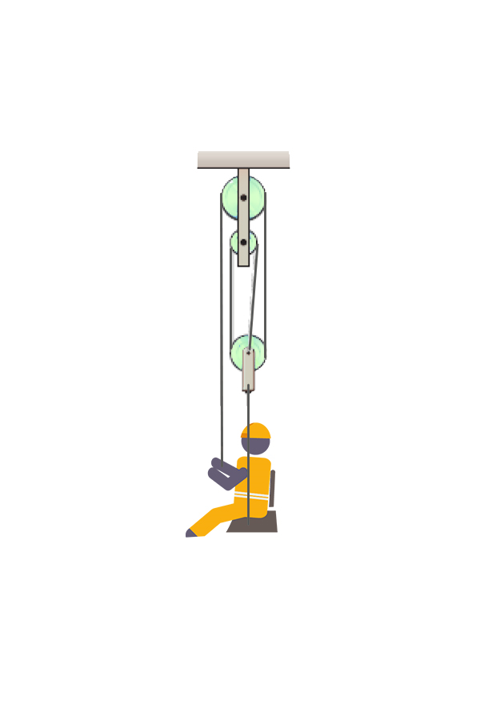

# {{ params.vars.title }}

## Question Text

The ${{params.m}}lb$ window washer pulls themselves up the rope with a force of ${{params.f}}lb$.
Find their acceleration $a$.
Neglect mass of the chair, ropes, and pulleys.

### Answer Section

Please enter an integer value in ${{ params.vars.units }}$.

## Attribution

Problem is licensed under the [CC-BY-NC-SA 4.0 license](https://creativecommons.org/licenses/by-nc-sa/4.0/).  