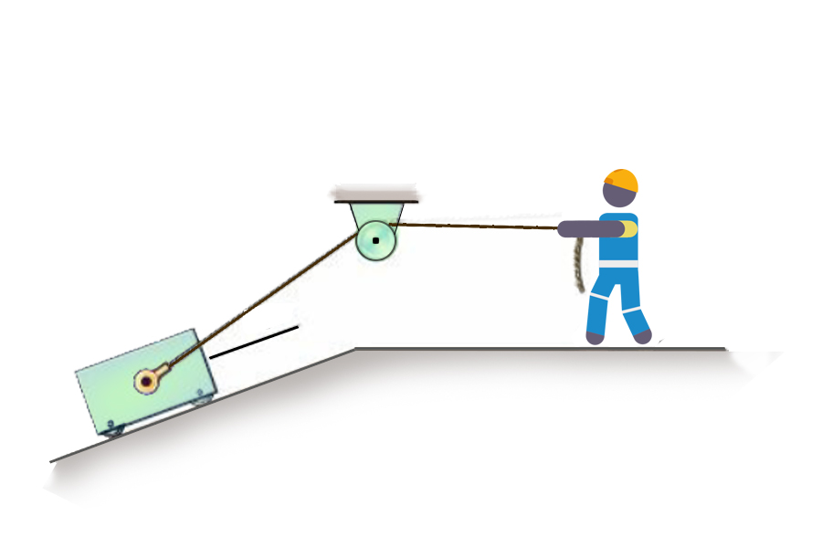

# {{ params.vars.title }}

A worker pulls a $m = {{params.m}}kg$ cart up a ${{params.theta_s}}^{\circ}$ frictionless incline, creating a tension $T$ in the cable.
The cable rises ${{params.theta_2}}^{\circ}$ to travel over a frictionless pulley.
Acceleration is positive if up the slope, negative if down.
Determine the acceleration for the following cases:

## Part 1

acceleration when $T = {{params.T_1}}N$.

### Answer Section

## Part 2

acceleration when $T = {{params.T_2}}N$.

### Answer Section

## Attribution

Problem is licensed under the [CC-BY-NC-SA 4.0 license](https://creativecommons.org/licenses/by-nc-sa/4.0/).  