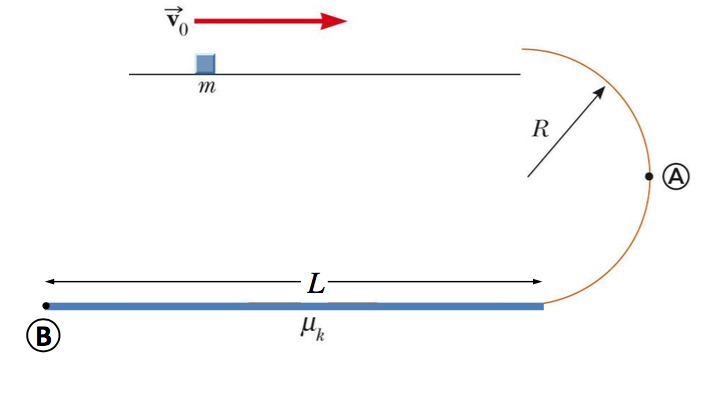

# {{ params.vars.title }}
A small block of mass m = {{params.m}} kg is fired with an initial speed $v_0$ = {{params.v}} m/s along a horizontal section of frictionless track, as shown in the top portion of the figure.
The block then moves along the frictionless semicircular vertical track of radius $R$ = {{params.R}}m.

## Part 1

Determine the force exerted by the track on the block at point A.

### Answer Section

Please enter in a numeric value in {{ params.vars.units }}.

## Part 2

The bottom of the track consists of a horizontal section (L = {{params.L}} m) with friction.
Determine the coefficient of kinetic friction between the block and the bottom portion of the track if the block just makes it to point B before coming to rest.

### Answer Section

Please enter in a numeric value.

## Attribution

Problem is licensed under the [CC-BY-NC-SA 4.0 license](https://creativecommons.org/licenses/by-nc-sa/4.0/).  