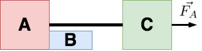

# {{ params.vars.title }}
Assume the three blocks portrayed in the figure move on a frictionless surface and a {{params.f_a}} N force
acts as shown on block C. The masses of the blocks are as follows: $m_a$ = {{params.m_a}} kg, $m_b$ = {{params.m_b}} kg, $m_c$ = {{params.m_c}} kg.

## Part 1

Determine the acceleration of block C.

### Answer Section

Please enter in a numeric value in {{ params.vars.units1 }}.

## Part 2

Determine the magnitude of the tension in the cord connecting block C and block A.

### Answer Section

Please enter in a numeric value in {{ params.vars.units2 }}.

## Part 3

Determine the force exerted by the block B on the block A.

### Answer Section

Please enter in a numeric value in {{ params.vars.units2}}.

## Attribution

Problem is licensed under the [CC-BY-NC-SA 4.0 license](https://creativecommons.org/licenses/by-nc-sa/4.0/).  