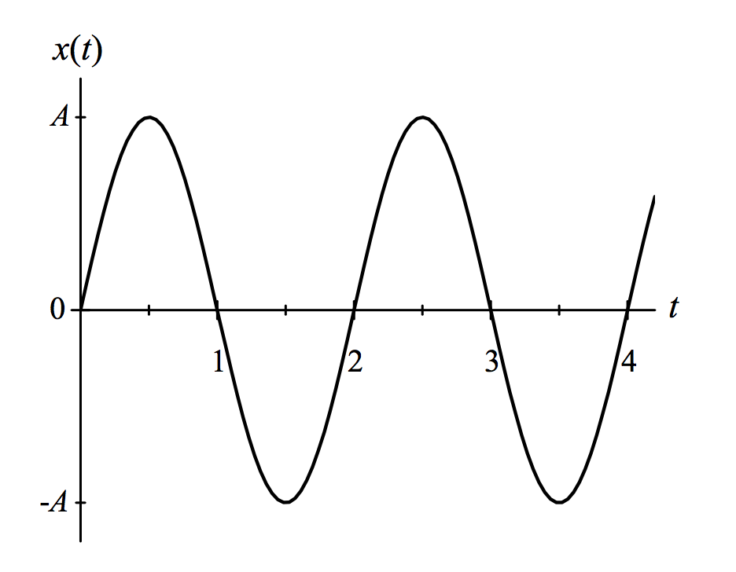

# {{ params.vars.title }}
The position versus time graph of a mass on a spring is shown in the image.

## Part 1

What can you say about the velocity of the mass and the net force of the mass at $t=2s$?
(For a right-handed coordinate system, positive $x$ is to the right)

### Answer Section

- {{ params.part1.ans1.value }}
- {{ params.part1.ans2.value }}
- {{ params.part1.ans3.value }}
- {{ params.part1.ans4.value }}
- {{ params.part1.ans5.value }}
- {{ params.part1.ans6.value }}
- {{ params.part1.ans7.value }}
- {{ params.part1.ans8.value }}
- {{ params.part1.ans9.value }}

## Attribution

Problem is licensed under the [CC-BY-NC-SA 4.0 license](https://creativecommons.org/licenses/by-nc-sa/4.0/).  