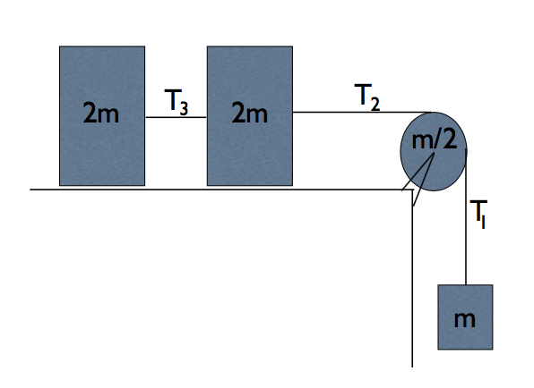

# {{ params.vars.title }}
As pictured, two blocks of mass $2m$ are connected by a rope of tension $T_3$ and pulled along a frictionless surface.
Another (massless) rope of tension $T_2$ connects the two blocks to a (frictionless) pulley of mass $m/2$, which is a disk of radius $R$.
The (massless) rope continues with tension $T_1$ on the other side of the pulley to a hanging mass of mass $m$.

## Part 1

Referring to the image, the tensions in the ropes satisfy:

### Answer Section

- {{ params.part1.ans1.value }}
- {{ params.part1.ans2.value }}
- {{ params.part1.ans3.value }}
- {{ params.part1.ans4.value }}
- {{ params.part1.ans5.value }}

## Part 2

Referring to the image, the magnitude of the acceleration of the system is:

### Answer Section

- {{ params.part2.ans1.value }} {{ params.vars.units }}
- {{ params.part2.ans2.value }} {{ params.vars.units }}
- {{ params.part2.ans3.value }} {{ params.vars.units }}
- {{ params.part2.ans4.value }} {{ params.vars.units }}
- {{ params.part2.ans5.value }} {{ params.vars.units }}

## Attribution

Problem is licensed under the [CC-BY-NC-SA 4.0 license](https://creativecommons.org/licenses/by-nc-sa/4.0/).  