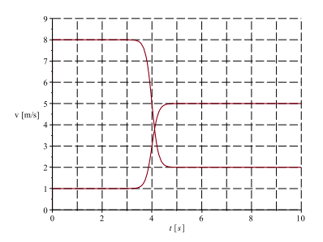

# {{ params.vars.title }}
Two {{ params.vars.vehicle }}s collide on a track, {{ params.vars.vehicle }}  A comes up behind {{ params.vars.vehicle }}  B and runs into it.
{{ params.vars.vehicle }} A has inertia {{ params.i_a }} {{ params.vars.units }}, {{ params.vars.vehicle }} B has inertia {{ params.i_b }} {{ params.vars.units }}.
The following diagram shows the velocity of each {{ params.vars.vehicle }} as a function of time.

## Attribution

Problem is licensed under the [CC-BY-NC-SA 4.0 license](https://creativecommons.org/licenses/by-nc-sa/4.0/).
