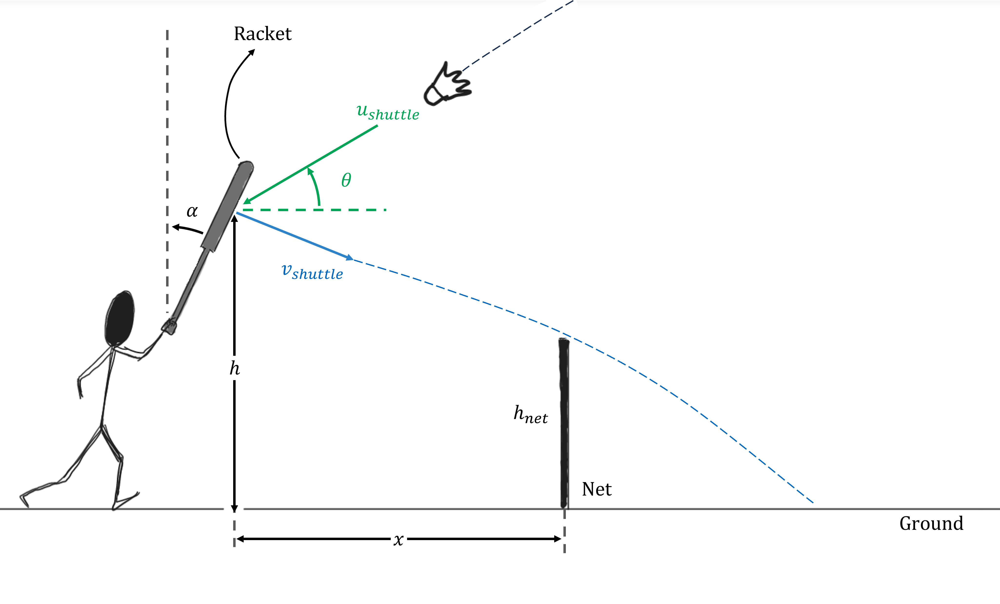

# Badminton Net Kill Shot
In a game of badminton, to counter a weak lift shot, the receiver can orient their racket at certain angle relative to the vertical. Thus, he/she is able to utilize the incoming momentum of the shuttle and principles of oblique impacts to return the shuttle at a steep angle without exerting an additional impulse. This agile shot is termed as a badminton net kill shot due to its play in close proximity to the net.

## Part 1

Treat the racquet and shuttle as particles with masses $0.5\ \rm{kg}$, $0.1\ \rm{kg}$ respectively in a vertical plane. Assume the racquet is stationary before the collision. Neglect aerodynamic drag and effects of gravity at the point of collision.
 
 
Calculate the angle($\alpha$) with which the racquet has to be oriented relative to the collision to achieve the desired trajectory as shown below.
 
$\theta = {{ params_theta }}^{\circ}$, $u\_{shuttle} = {{ params.u_s }}\ \rm{ms^{-1}}$ , $v\_{shuttle} = {{ params.v_s }}\ \rm{ms^{-1}}$, $h = {{ params_h }}\ \rm{m}$, $h\_{net} = 1.524\ \rm{m}$, $x = 1.626\ \rm{m}$
 
<i>You may have to use the compound angle identity:</i> $sin⁡(A \pm B) = sin(⁡A)cos(B) \pm cos(⁡A)sin(⁡B)$

### Answer Section

Please enter in a numeric value in $\circ$.

## Part 2

Determine the the magnitude of the final velocity of the racket. Treat the badminton racket as a rigid body.

### Answer Section

Please enter the value of $v\_{racket}$ in $ms^{-1}$.

## Part 3

Determine the coefficient of restitution($e$) between the racket and the shuttle.

### Answer Section

Please enter the value of $e$.

## Attribution

Problem is licensed under the [CC-BY-NC-SA 4.0 license](https://creativecommons.org/licenses/by-nc-sa/4.0/).  