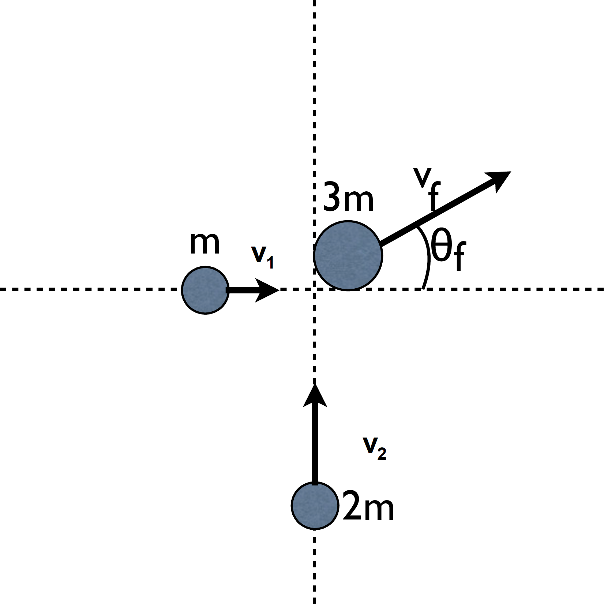

# {{ params.vars.title }}
Particles of mass $m$ and $2m$ have velocities $v_1=$ {{ params.v1 }}$v\hat{x}$ and $v_2=$ {{ params.v2 }}$v\hat{y}$ respectively.

## Part 1

After undergoing a perfectly inelastic collision as shown in the figure, what velocity, $v_f$, does the resulting particle have? Enter the magnitude of $v_f$.

### Answer Section

Please enter in a numeric value.

## Part 2

What angle with respect to the $x-$axis, $\theta_f$, does the resulting velocity make?

### Answer Section

Please enter in a numeric value in degrees.

## Attribution

Problem is licensed under the [CC-BY-NC-SA 4.0 license](https://creativecommons.org/licenses/by-nc-sa/4.0/).  