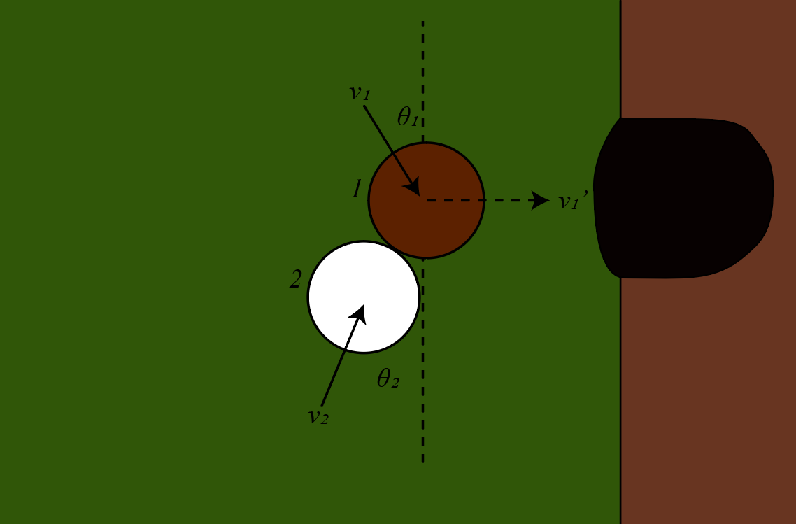

# {{ params_vars_title }}

A trickshot set up in pool requires a player to hit a moving ball directly into the pocket.
The balls collide in front of the pocket as shown above.
Before the collision, $v_1$ has a velocity $\theta_1= {{params_thetad}}^\circ$.
The second ball has a velocity equal in magnitude at an angle $\theta_2$.
Determine the two possible values of $\theta_2$ which will cause Ball 1 to go directly into the pocket for the trickshot.
The coefficient of restitution is ${{params_e}}$.

## Part 1

Enter the larger angle

### Answer Section

Please enter in a numeric value in $^\circ$.

## Part 2

Enter the smaller angle

### Answer Section

Please enter in a numeric value in $^\circ$.

## Attribution

Problem is licensed under the [CC-BY-NC-SA 4.0 license](https://creativecommons.org/licenses/by-nc-sa/4.0/).  