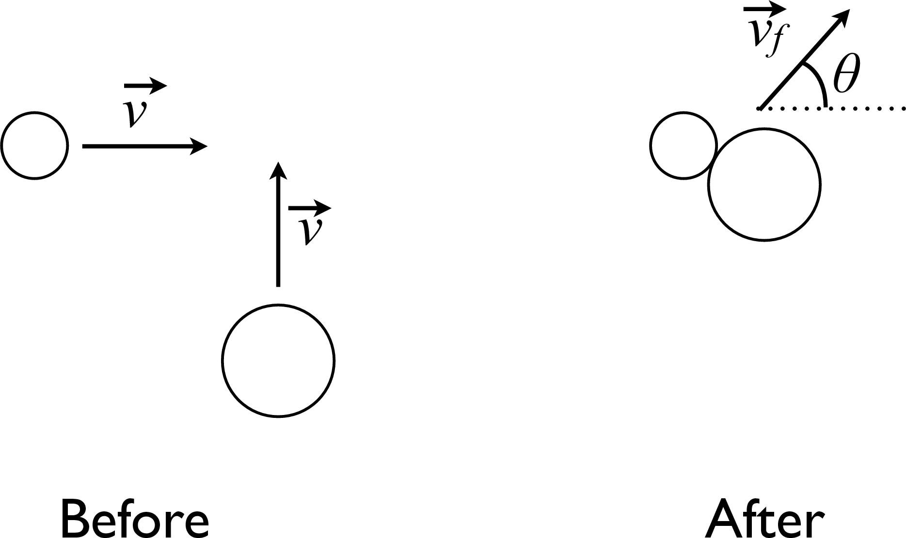

# {{ params_vars_title }}
A perfectly inelastic collision occurs between an object of mass $m$ initially travelling along the positive $x$-axis at speed $v$, and an object of mass {{ params_k }}$m$ initially travelling along the positive $y$-axis at the same speed $v$. Following the collision the objects stick together and travel at a final speed $v_f$ at an angle $\theta$ degrees from the positive $x$-axis as shown in the figure below.

  

## Part 1

The value of the angle $\theta$ is:

### Answer Section

- {{ params_part1_ans1_value }} {{ params_vars_units}}
- {{ params_part1_ans2_value }} {{ params_vars_units}}
- {{ params_part1_ans3_value }} {{ params_vars_units}}
- {{ params_part1_ans4_value }} {{ params_vars_units}}
- {{ params_part1_ans5_value }} {{ params_vars_units}}

## Attribution

Problem is licensed under the [CC-BY-NC-SA 4.0 license](https://creativecommons.org/licenses/by-nc-sa/4.0/).  