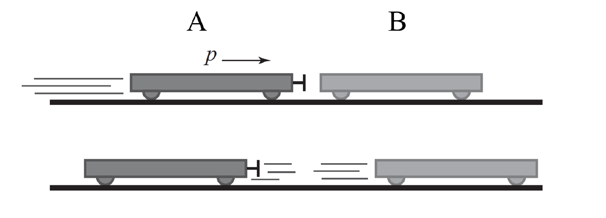

# {{ params.vars.title }}
Cart A with momentum of magnitude $p$ collides with cart B and rebounds. Cart B is initially at rest.

## Part 1

What can you say about the momentum of cart B after the collision?

### Answer Section

- {{ params.part1.ans1.value }}
- {{ params.part1.ans2.value }}
- {{ params.part1.ans3.value }}
- {{ params.part1.ans4.value }}

## Attribution

Problem is licensed under the [CC-BY-NC-SA 4.0 license](https://creativecommons.org/licenses/by-nc-sa/4.0/).  