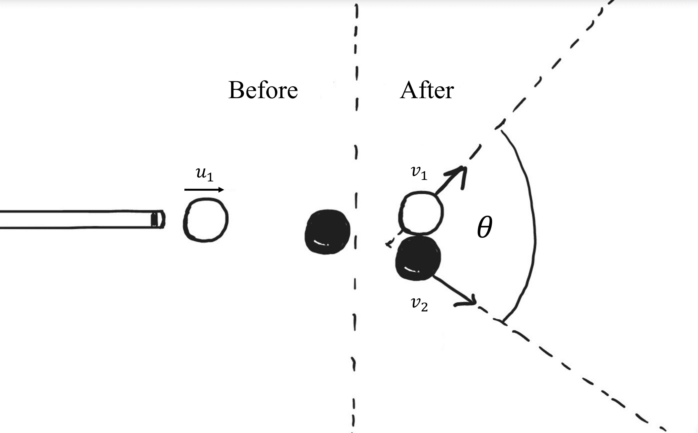
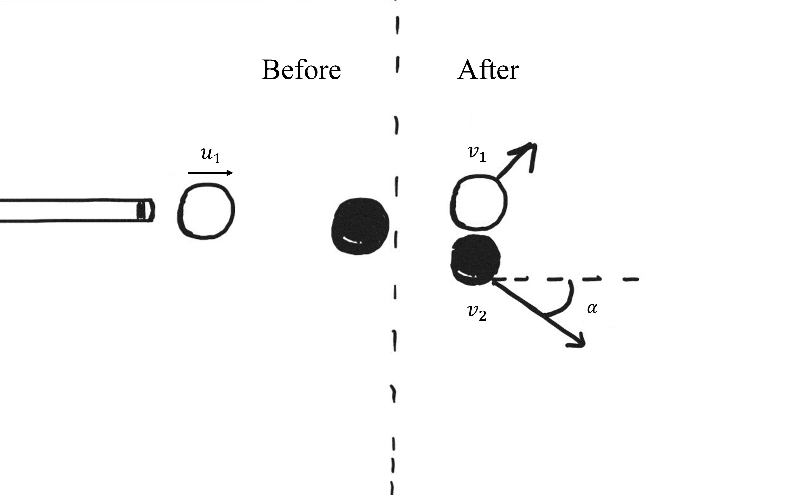

# Pool ball collision
In a game of pool, the white cue ball is shot in a straight line towards a stationary black ball with speed $u_1$.
 

## Part 1

If the oblique collision is deemed perfectly elastic, what is the angle $\theta$ with which each ball is deflected relative to each other? 
Treat the two balls as particles having the same mass and neglect any resistive forces.

### Answer Section

Please enter the angle in $\circ$.

## Part 2

If the **black** ball leaves the collision at an angle $\alpha$ measured from below the horizontal, what is the speed of the **black** ball after the collision?
 
$u_1 = {{ params_u }}\ \rm{ms^{-1}}$ , $\alpha = {{ params_a }}^{\circ}$

### Answer Section

Please enter the speed of the black ball in $ms^{-1}$.

## Part 3

What is the speed of the **white** cue ball after the collision?

### Answer Section

Please enter the speed of the white cue ball in $ms^{-1}$.

## Part 4

If the final direction of one of the balls was undetermined, using the principles of conservation of momentum and energy, can the speeds of the two balls leaving the collision be determined?

### Answer Section

- {{ params_part4_ans1_value}}
- {{ params_part4_ans2_value}}

## Attribution

Problem is licensed under the [CC-BY-NC-SA 4.0 license](https://creativecommons.org/licenses/by-nc-sa/4.0/).  