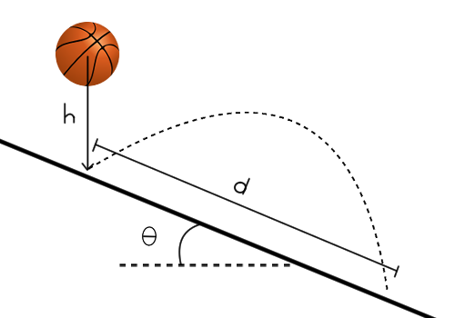

# {{ params_vars_title }}
A ball is dropped from a height ${{params_h}} \ \rm{m}$ above a ${{params_theta}}^{\circ}$ sloped ramp. The coefficient of restitution between the ball and the ramp is $e={{params_e}}$.

## Part 1

What is the flight time between the initial collision and the second time it hits the ramp?

### Answer Section

Please enter in a numeric value in s.

## Part 2

How far along the ramp did the ball travel in that bounce?

### Answer Section

Please enter in a numeric value in m.

## Attribution

Problem is licensed under the [CC-BY-NC-SA 4.0 license](https://creativecommons.org/licenses/by-nc-sa/4.0/).  