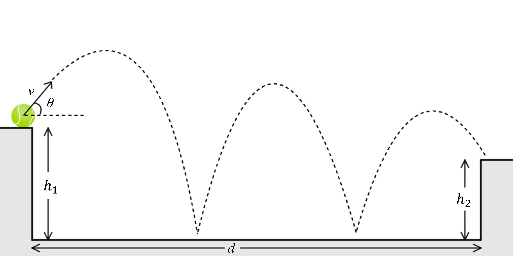

# {{ params_vars_title }}
A rubber ball is launched off a platform $h_1={{params_h1}} \ \rm{m}$ high with an initial velocity $v={{params_v}} \ \rm{m/s}$ at an angle ${{params_theta}}^\circ$.
The ball bounces its way onto another platform $h_2={{params_h2}} \ \rm{m}$ high.
The coefficient of restitution between the ball and the ground is ${{params_e}}$.
The ball just barely makes it onto the platform.
In other words, if the platform was any farther, the ball wouldn't have made it.

## Part 1

How many times did the ball bounce?

### Answer Section

Please enter in a numeric value.

## Part 2

At what horizontal distance $d$ was the platform from the launch surface?

### Answer Section

Please enter in a numeric value in m.

## Attribution

Problem is licensed under the [CC-BY-NC-SA 4.0 license](https://creativecommons.org/licenses/by-nc-sa/4.0/).  