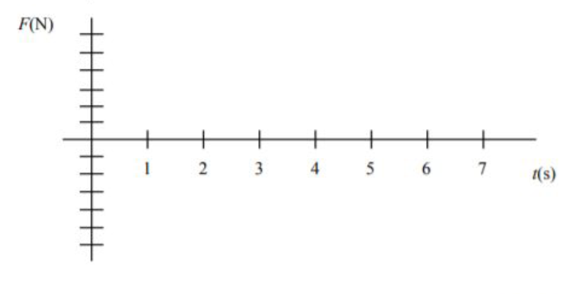

# {{ params.vars.title }}
Two carts collide on a frictionless track aligned with the $x$-axis. The force versus time graph for the force exerted by cart 1 on cart 2 is shown in the figure below.

## Part 1

Sketch the force versus time graph for the force exerted by cart 2 on cart 1 on the axes below.
Do this by downloading the image (right-click $\to$ save image as) and drawing on it.
Upload your graph as a pdf titled "part1.pdf". Be sure to label the graph $F\_{\text{2 on 1}}$ and put numbers on the vertical axis.

### Answer Section

File upload box will be shown here.

## Part 2

Find the $x$-component of the impulse that cart 1 exerts on cart 2 $(I\_{\text{1 on 2}})\_x$.

### Answer Section

Please enter in a numeric value in $\rm{kg \cdot m / s}$.

## Part 3

If cart 2 has a mass of {{ params.m2 }} $\rm{g}$ and an initial of velocity along the $x$-axis of $v\_{2xi} = ${{ params.vi }} $\rm{m/s}$, find the $x$-component of cart 2's velocity following the collision $v\_{2xf}$.

### Answer Section

Please enter in a numeric value in {{ params.vars.units }}.

## Part 4

Assuming that cart 1 starts to the left of cart 2 (and the positive x-axis is to the right), label the regions of the force vs. time graph you sketched in part 1 as having repulsive or attractive forces.
Re-upload your image as a pdf titled "part4.pdf".

### Answer Section

File upload box will be shown here.

## Part 5

What could cause an attractive force between the carts? (We have four end types on our carts: magnets, springs, clay, or Velcro).

### Answer Section

Select all the choices that apply.
Note: You will be awarded full marks only if you select all the correct choices, and none of the incorrect choices. Choosing incorrect choices as well as not choosing correct choices will result in deductions.

- {{ params.part5.ans1.value }}
- {{ params.part5.ans2.value }}
- {{ params.part5.ans3.value }}
- {{ params.part5.ans4.value }}

## Part 6

If the collision was perfectly inelastic, what would be the $x$-component of the velocity of cart 1 after the collision $v\_{1xf}$?

### Answer Section

Please enter in a numeric value in {{ params.vars.units }}.

## Part 7

If cart 1 had a mass of {{ params.m1 }} $\rm{kg}$ and underwent a perfectly inelastic collision, what was the $x$-component of its initial velocity $v\_{1xi}$?

### Answer Section

Please enter in a numeric value in {{ params.vars.units }}.

## Attribution

Problem is licensed under the [CC-BY-NC-SA 4.0 license](https://creativecommons.org/licenses/by-nc-sa/4.0/).  