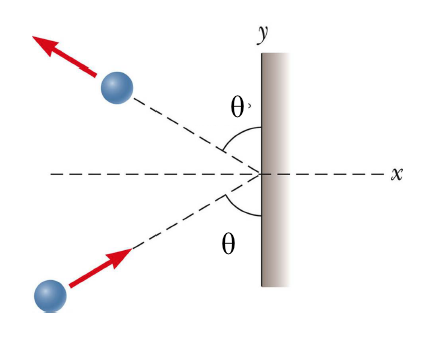

# {{ params.vars.title }}
A {{params.m}} kg steel bass strikes a massive wall at {{params.v}} m/s at an angle of {{params.theta}} with the plane of the wall. It bounces off of the wall with the same speed and angle (see the figure).

## Part 1

What is the x-component of the impulse that the wall exerts on the ball during the collision?

### Answer Section

Please enter in a numeric value in {{ params.vars.units1 }}.

## Part 2

If the ball is in contact with the wall for 0.200 s, what is the average force that the wall exerts on the ball during the collision?

### Answer Section

Please enter in a numeric value in {{ params.vars.units2 }}.

## Attribution

Problem is licensed under the [CC-BY-NC-SA 4.0 license](https://creativecommons.org/licenses/by-nc-sa/4.0/).  