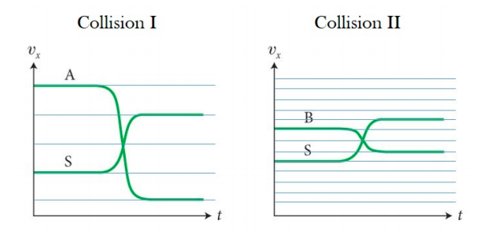

# {{ params.vars.title }}
The figure below shows the velocity versus time graphs of two different collisions. The graph on the left shows a collision between cart A and cart S. The graph of the right shows a collision between cart B and cart S.

## Part 1

If $\frac{m_A}{m_S}$ = 1/2 and $\frac{m_B}{m_S}$ = 3, for which of the collisions is the system of carts an isolated system?

### Answer Section

- {{ params.part1.ans1.value }}
- {{ params.part1.ans2.value }}
- {{ params.part1.ans3.value }}
- {{ params.part1.ans4.value }}

## Attribution

Problem is licensed under the [CC-BY-NC-SA 4.0 license](https://creativecommons.org/licenses/by-nc-sa/4.0/).  