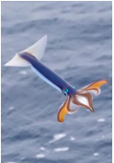

# {{ params.vars.title }}
The Japanese flying squid, shown in the photograph below, is able to "jump" off the surface of the sea by taking water into its body cavity and then ejecting the water vertically downward. A squid is able to eject {{params.m1}} $kg$ of water with a speed of {{params.v}} $m/s$. Without any water in its cavity, the mass of the squid is {{params.m2}} $kg$.

## Part 1

If starting from rest at the surface of the sea, what will be the speed of the squid immediately after ejecting the water?

### Answer Section

Please enter in a numeric value in {{ params.vars.units1 }}.

## Part 3

How high above the surface of the sea will the squid rise?

### Answer Section

Please enter in a numeric value in {{ params.vars.units2 }}.

## Attribution

Problem is licensed under the [CC-BY-NC-SA 4.0 license](https://creativecommons.org/licenses/by-nc-sa/4.0/).  