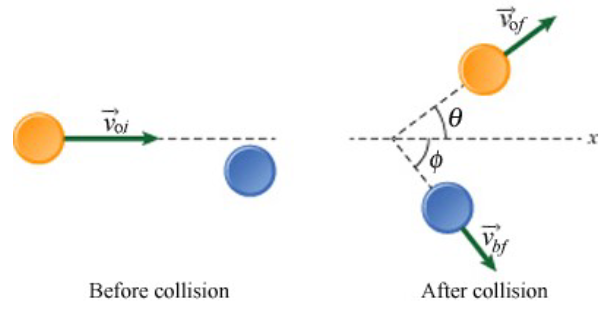

# {{ params.vars.title }}
Consider a system of two pucks on a frictionless surface. An orange puck moving with velocity $\vec{v\_{oi}}$ collides with a blue puck that is initially at rest. At the time of the collision, a small explosion injects {{ params.E }} $J$ of energy into the system. Afterwards, the pucks move as shown in the figure below.

<h5>Long Description of image: Figure of the system described.</h5>
Before the collision. The orange puck moves with horizontal velocity v o i (o for orange and i for initial) towards the right. The blue puck is at rest. 
After the collision. Both pucks move in opposite directions. The orange puck moves with a velocity v o f (f for final) at an angle theta with respect to the positive x-axis. The blue puck moves with a velocity v b f (b for blue) at an angle phi with respect to the positive x-axis.

Long description ends.

## Part 1

Which of the statements below best describes how the system's momentum and kinetic energy change after the collision and explosion?

### Answer Section

- {{ params.part1.ans1.value }}
- {{ params.part1.ans2.value }}
- {{ params.part1.ans3.value }}
- {{ params.part1.ans4.value }}

## Attribution

Problem is licensed under the [CC-BY-NC-SA 4.0 license](https://creativecommons.org/licenses/by-nc-sa/4.0/).  