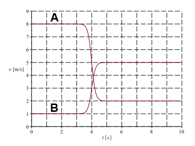

# {{ params.vars.title }}
Two {{ params.vars.vehicle }}s collide on a track. {{ params.vars.vehicle_c }}  A comes up behind {{ params.vars.vehicle }}  B and runs into it.
{{ params.vars.vehicle_c }} A has mass of {{ params.i_a }} {{ params.vars.units }}, {{ params.vars.vehicle }} B has mass of {{ params.i_b }} {{ params.vars.units }}.
The following graph shows the velocity of each {{ params.vars.vehicle }} as a function of time.

## Question Text

Is the system isolated? Why or why not?

### Answer Section

- {{ params.part1.ans1.value }}
- {{ params.part1.ans2.value }}
- {{ params.part1.ans3.value }}
- {{ params.part1.ans4.value }}

## Attribution

Problem is licensed under the [CC-BY-NC-SA 4.0 license](https://creativecommons.org/licenses/by-nc-sa/4.0/).  