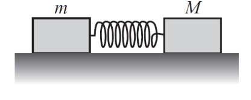

# {{ params.vars.title }}
Two blocks, $M =$ {{ params.x }}$m$, sit on a horizontal frictionless surface with a compressed massless spring between them.
After the spring is released $M$ has velocity $v$.

## Part 1

What was the total energy initially stored in the spring?

### Answer Section

- {{ params.part1.ans1.value }}
- {{ params.part1.ans2.value }}
- {{ params.part1.ans3.value }}
- {{ params.part1.ans4.value }}
- {{ params.part1.ans5.value }}

## Attribution

Problem is licensed under the [CC-BY-NC-SA 4.0 license](https://creativecommons.org/licenses/by-nc-sa/4.0/).  