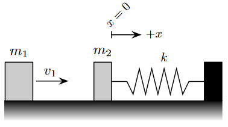

# {{ params.vars.title }}
A block of mass $m_1$ slides across a frictionless surface with speed $v_1$ and collides perfectly elastically with a block $m_2$ (initially at rest).
Block $m_2$ is attached to a spring with spring constant $k$ and equilibrium length $x_0$.
Assume $m_2 > m_1$.

## Part 1

What is the amplitude of the resulting simple harmonic motion? Answer using the variables $m_1, m_2, k, x_0$ and/or $v_1$.

Note that it may not be necessary to use every variable. Use the following table as a reference for each variable:

| $Variable $ | Use   |
|----------|-------|
| $m_1$  | m1  |
| $m_2$  | m2  |
| $x_0$  | x0 |
| $k$  | k  |
| $v_1$  | v1  |

### Answer Section

Enter answer here...

## Part 2

What is the period of the resulting simple harmonic motion?
Answer using the variables $m_1, m_2, k, x_0$ and/or $v_1$.

Note that it may not be necessary to use every variable. Use the following table as a reference for each variable:

| $Variable $ | Use   |
|----------|-------|
| $m_1$  | m1  |
| $m_2$  | m2  |
| $x_0$  | x0 |
| $k$  | k  |
| $v_1$  | v1  |

### Answer Section

Enter answer here...

## Part 3

What is the position of $m_2$ as a function of time?
Note that the $+x$ direction is defined as to the right in the diagram.
Assume $t= 0$ at the time of collision.
Answer using the variables $t, A$ and/or $\omega$.

Note that it may not be necessary to use every variable and that the correct answer will simplify all trigonometric functions (simplifying your answer is not required).
Use the following table as a reference for each variable:

| $Variable $ | Use   |
|----------|-------|
| $t$ | t |
| $A$ | A |
| $\omega$ | w |

### Answer Section

Enter answer here...

## Attribution

Problem is licensed under the [CC-BY-NC-SA 4.0 license](https://creativecommons.org/licenses/by-nc-sa/4.0/).  