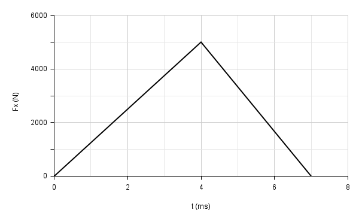

# {{ params.vars.title }}
To measure the interaction force between a basketball and the backboard, we attached a force plate to the backboard. When a {{ params.m }} $\rm{g}$ basketball hit the force plate with a speed of {{ params.v }} $\rm{m/s}$, a graph of force of the plate on the ball versus time ($\rm{ms}$) was recorded as shown in the figure.

## Part 1

What was the rebound speed of the ball from the plate? \[Hint: since the force is in the $+x$-direction, the ball must be thrown in the $-x$-direction.\]

### Answer Section

Please enter in a numeric value in $\rm{m/s}$.

## Attribution

Problem is licensed under the [CC-BY-NC-SA 4.0 license](https://creativecommons.org/licenses/by-nc-sa/4.0/).  