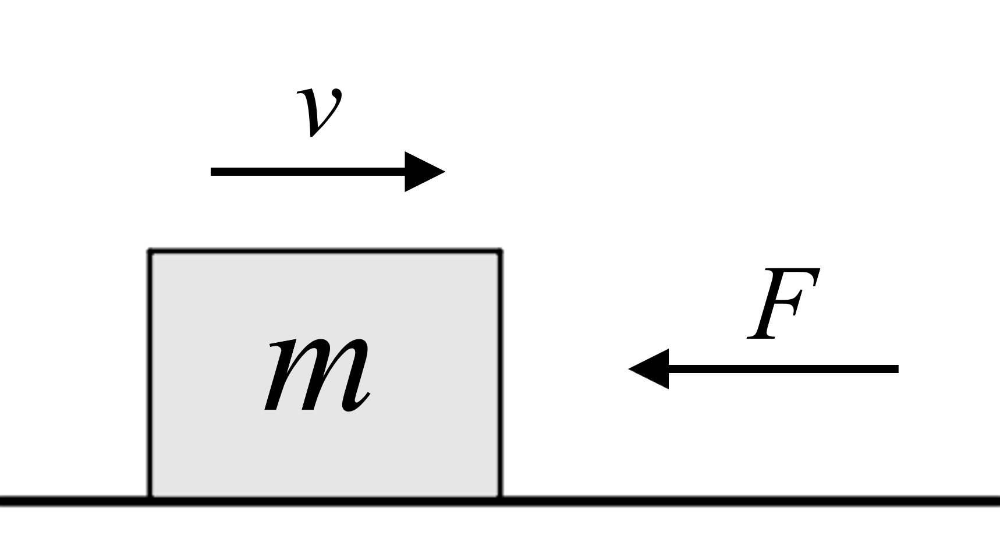

# {{ params_vars_title }}
An object is traveling with a speed of ${{params_v}}\ \rm{m/s}$.
At $t = 0$, a force whose magnitude follows the relation $F = {{params_k}}t \ \rm{N}$ is applied in the direction opposite to motion.

## Part 1

If the object decelerates to a complete stop in ${{params_t}} \ \rm{s}$, what is its mass?

### Answer Section

Please enter in a numeric value in kg.

## Attribution

Problem is licensed under the [CC-BY-NC-SA 4.0 license](https://creativecommons.org/licenses/by-nc-sa/4.0/).  