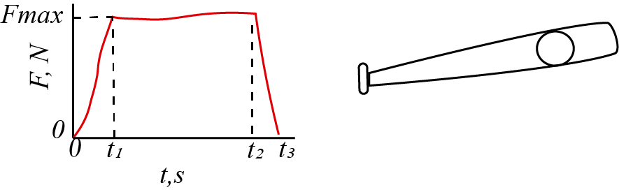

# {{ params_vars_title }}

At a baseball game, the force of a bat hitting the ball is recorded.If the impact force varies with time as shown in the diagram, determine the magnitude of impulse by the bat on the baseball.
$F\_{max} = {{params_F}} N$, $t_1 = {{params_t1}}s$ and $t_2 = {{params_t2}}s$,  $t_3 = {{params_t3}}s$.

## Part 1

### Answer Section

Please enter in a numeric value in $N \bullet s$.

## Attribution

Problem is licensed under the [CC-BY-NC-SA 4.0 license](https://creativecommons.org/licenses/by-nc-sa/4.0/).  