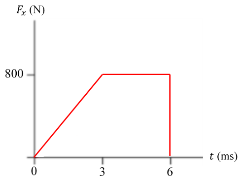

# {{ params_vars_title }}

Given the force-time plot shown in the figure,

## Part 1

Determine the impulse the force exerts on a {{ params_m }} $\rm{g}$ particle.

### Answer Section

Please enter in a numeric value in $\rm{Ns}$.

## Part 2

Determine the final speed of the particle at the end of the impulse.

### Answer Section

Please enter in a numeric value in $\rm{m/s}$.

## Attribution

Problem is licensed under the [CC-BY-NC-SA 4.0 license](https://creativecommons.org/licenses/by-nc-sa/4.0/).  