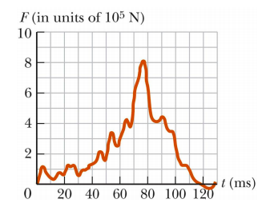

# {{ params.vars.title }}
The figure below shows the force on a {{ params.vars.vehicle }} during a typical collision used during safety tests.
The mass of the {{ params.vars.vehicle }} is {{ params.m }} $kg$ and it comes to rest at the end of the collision.

## Part 1

What was the *approximate* speed of the car just before the impact? Choose the best answer.

### Answer Section

- {{ params.part1.ans1.value }} {{ params.vars.units}}
- {{ params.part1.ans2.value }} {{ params.vars.units}}
- {{ params.part1.ans3.value }} {{ params.vars.units}}
- {{ params.part1.ans4.value }} {{ params.vars.units}}
- {{ params.part1.ans5.value }} {{ params.vars.units}}

## Attribution

Problem is licensed under the [CC-BY-NC-SA 4.0 license](https://creativecommons.org/licenses/by-nc-sa/4.0/).  