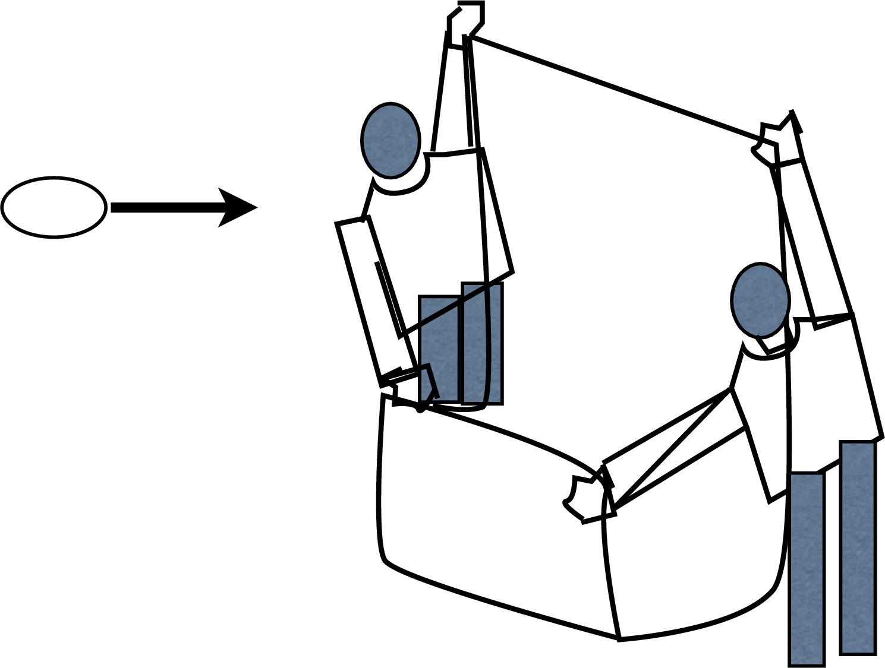

# {{ params.vars.title }}
{{ params.vars.name }} throws an egg as hard as they can towards a bed sheet held vertically by two of their friends.
The bottom of the sheet is shaped like a "J" to catch the egg after if falls.

## Part 1

The egg does not break.

This is because:

### Answer Section

- {{ params.part1.ans1.value }}
- {{ params.part1.ans2.value }}
- {{ params.part1.ans3.value }}
- {{ params.part1.ans4.value }}
- {{ params.part1.ans5.value }}

## Attribution

Problem is licensed under the [CC-BY-NC-SA 4.0 license](https://creativecommons.org/licenses/by-nc-sa/4.0/).  