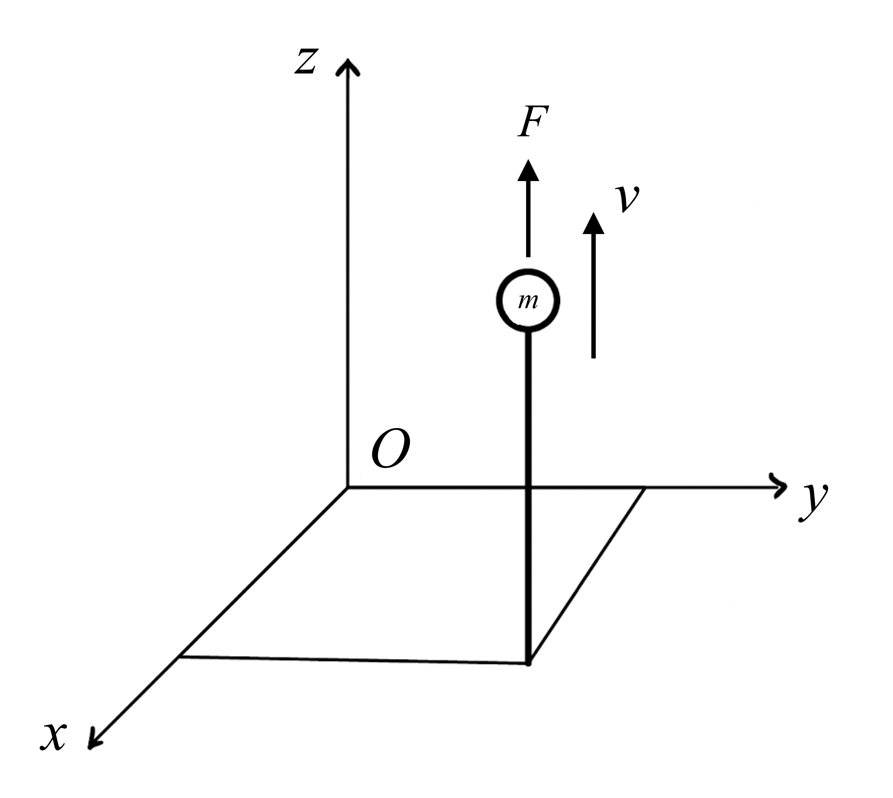

# {{ params_vars_title }}

A particle has a mass of $m = {{params_m}} \ \rm{kg}$ and has a velocity of $v = {{params_v}} \ \rm{m/s}$. The force acting upon this particle is $F = {{params_F}} \ \rm{N}$, and the position is given by $({{params_x}} ,{{params_y}} ,{{params_z}} )$. What is the angular momentum about the origin and its time derivative?

## Part 1

What is $H_x$?

### Answer Section

Please enter in a numeric value in $\rm{N-m-s}$.

## Part 2

What is $H_y$?

### Answer Section

Please enter in a numeric value in $\rm{N-m-s}$.

## Part 3

What is $H_z$?

### Answer Section

Please enter in a numeric value in $\rm{N-m-s}$.

## Part 4

What is $\dot{H_x}$?

### Answer Section

Please enter in a numeric value in $\rm{N.m}$.

## Part 5

What is $\dot{H_y}$?

### Answer Section

Please enter in a numeric value in $\rm{N.m}$.

## Part 6

What is $\dot{H_z}$?

### Answer Section

Please enter in a numeric value in $\rm{N.m}$.

## Attribution

Problem is licensed under the [CC-BY-NC-SA 4.0 license](https://creativecommons.org/licenses/by-nc-sa/4.0/).  