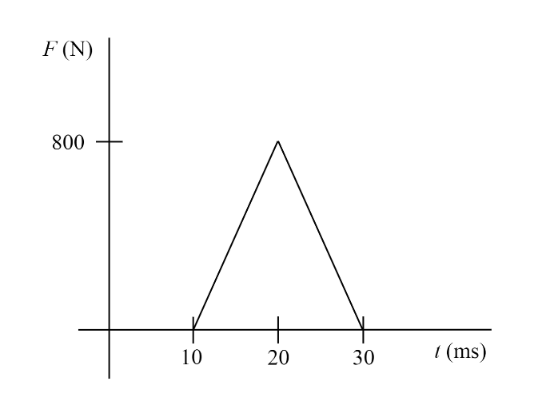

# {{ params.vars.title }}
The force that a cricket bat puts on a cricket ball as a function of time is shown in the diagram below.

## Part 1

The change in momentum of the cricket bat due to this collision is:

### Answer Section

- {{ params.part1.ans1.value }}
- {{ params.part1.ans2.value }}
- {{ params.part1.ans3.value }}
- {{ params.part1.ans4.value }}
- {{ params.part1.ans5.value }}

## Attribution

Problem is licensed under the [CC-BY-NC-SA 4.0 license](https://creativecommons.org/licenses/by-nc-sa/4.0/).  