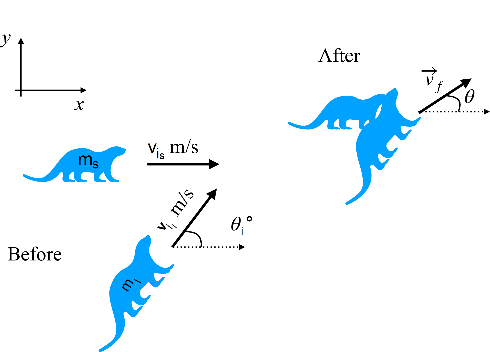

# {{ params.vars.title }}
Two river otters collide while sliding across frictionless ice and get tangled together following the (perfectly inelastic) collision as shown in the figure, where a coordinate system has been defined.

The smaller otter ($m_s =$ {{ params.m_s }} $kg$) is initially moving at $v\_{i_s} = $ {{ params.vis }} $m/s$ along the x-axis, while the larger otter ($m_l =$ {{ params.m_l }} $kg$) is initially moving at $v\_{i_l} = $ {{ params.vil }} $m/s$, $\theta_i=${{ params.theta_i }}$^{\circ}$ counterclockwise from the x-axis.

## Part 1

Find the $x$-component of the initial momentum of the smaller otter.

### Answer Section

Please enter in a numeric value in $kg\cdot m/s$.

## Part 2

Find the $y$-component of the initial momentum of the smaller otter.

### Answer Section

Please enter in a numeric value in $kg\cdot m/s$.

## Part 3

Find the $x$-component of the initial momentum of the larger otter.

### Answer Section

Please enter in a numeric value in $kg\cdot m/s$.

## Part 4

Find the $y$-component of the initial momentum of the larger otter.

### Answer Section

Please enter in a numeric value in $kg\cdot m/s$.

## Part 5

Find the $x$-component of the total final momentum of the tangled otters in component form.

### Answer Section

Please enter in a numeric value in $kg\cdot m/s$.

## Part 6

Find the $y$-component of the total final momentum of the tangled otters in component form.

### Answer Section

Please enter in a numeric value in $kg\cdot m/s$.

## Part 7

What direction do the river otters end up heading in, relative to the $x$-axis as defined in the figure?

### Answer Section

Please enter in a numeric value in degrees.

## Part 8

What is the speed of the otters after this collision?

### Answer Section

Please enter in a numeric value in $m/s$.

## Part 9

Is kinetic energy lost, gained, or does it remain constant in this collision?

If the difference in kinetic energy is less than 0.05, consider that kinetic energy has remained unchanged.

### Answer Section

- {{ params.part9.ans1.value}}
- {{ params.part9.ans2.value}}
- {{ params.part9.ans3.value}}

## Attribution

Problem is licensed under the [CC-BY-NC-SA 4.0 license](https://creativecommons.org/licenses/by-nc-sa/4.0/).  