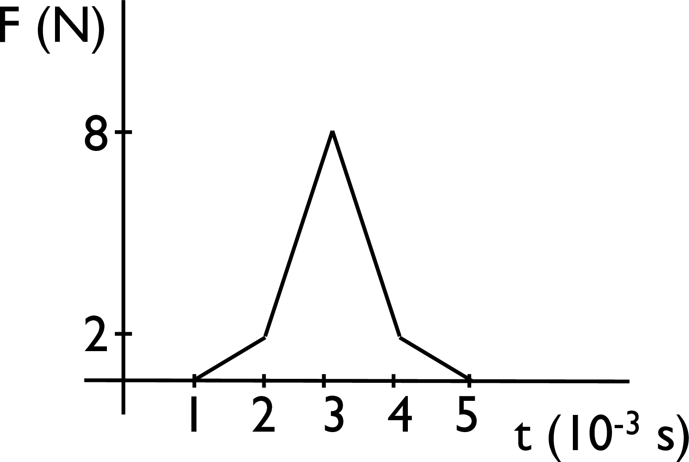

# {{ params.vars.title }}
A force versus time graph for the force on a mosquito is given in the figure below.

## Question Text

Calculate the change in momentum of the mosquito due to this impulsive force.

### Answer Section

Please enter in a numeric value in {{ params.vars.units }}.

## Attribution

Problem is licensed under the [CC-BY-NC-SA 4.0 license](https://creativecommons.org/licenses/by-nc-sa/4.0/).  