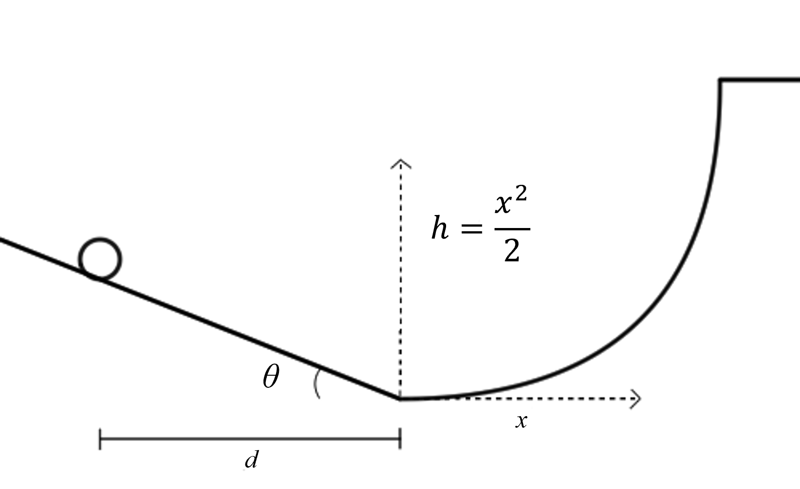

# {{ params_vars_title }}
A ball, initially at rest, rolls down a hill slanted $\theta = {{params_theta}}^{\circ}$.
After traveling a horizontal distance $d = {{params_d}} \ \rm{m}$, it moves up a curve whose height follows the equation $h(x) = \frac{x^2}{2}$.

## Part 1

To what height $h$ does the ball make it up the curve?
Neglect friction, and assume a smooth transition from one section to the other.

### Answer Section

Please enter in a numeric value in m.

## Part 2

To what horizontal distance $x$ does the ball travel from the start of the curve?

### Answer Section

Please enter in a numeric value in m.

## Attribution

Problem is licensed under the [CC-BY-NC-SA 4.0 license](https://creativecommons.org/licenses/by-nc-sa/4.0/).  