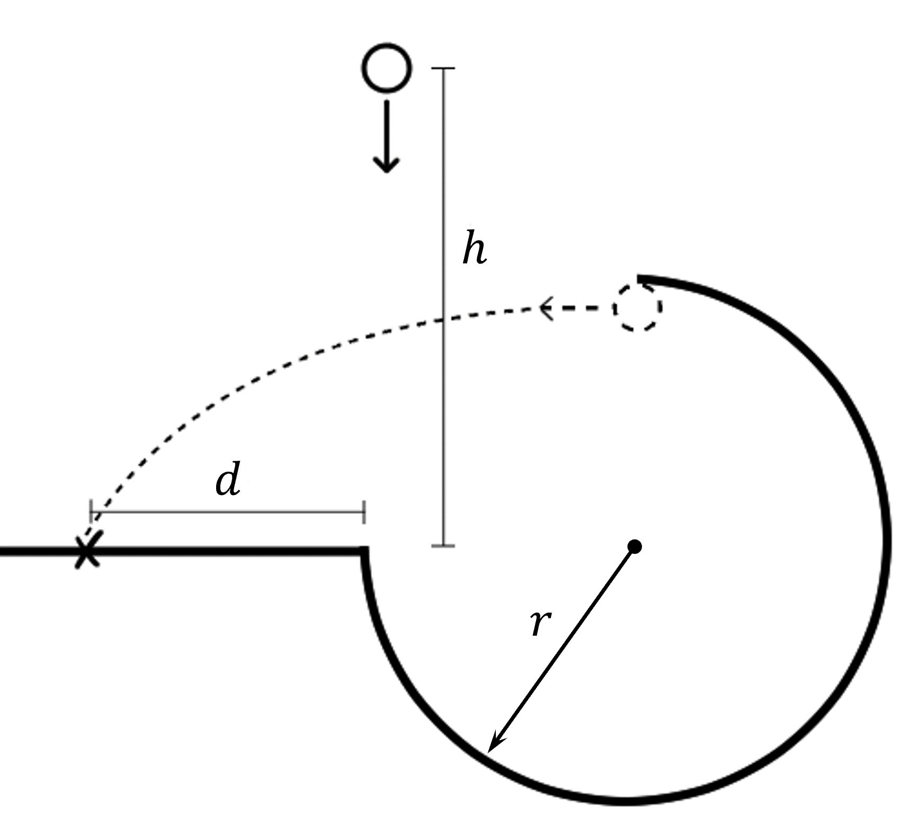

# {{ params_vars_title }}
A ball, initially at rest, falls into a curved path as illustrated below. It follows the path until the peak, and gets launched onto a platform aside.
The curvature has a radius $r={{params_r}} \ \rm{m}$.
Neglect friction.

## Part 1

From what height $h$ must the ball be dropped to always maintain contact with the loop and land on the platform?

### Answer Section

Please enter in a numeric value in m.

## Part 2

At what distance $d$ from the loop does the ball land?

### Answer Section

Please enter in a numeric value in m.

## Attribution

Problem is licensed under the [CC-BY-NC-SA 4.0 license](https://creativecommons.org/licenses/by-nc-sa/4.0/).  