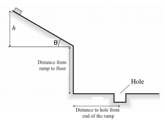

# {{ params.vars.title }}
A small block is placed at height $h$ on a frictionless, {{params.a}}$^\circ$ ramp.
Upon being released (from rest), the block slides down the ramp and then falls {{params.d}} $m$ to the floor.
A small hole is located {{params.d}} $m$ from the end of the ramp.

## Question Text

From what height $h$ should the block be released in order to land in the hole?

### Answer Section

Please enter in a numeric value in {{ params.vars.units }}.

## Attribution

Problem is licensed under the [CC-BY-NC-SA 4.0 license](https://creativecommons.org/licenses/by-nc-sa/4.0/).  