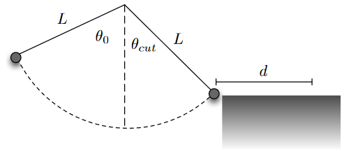

# {{ params.vars.title }}
In the mobile app "Cut the Rope", a mass (of candy) swings on a rope and the game player selects a point to cut the rope so it lands in a cute little monster's mouth.
Imagine that the mass is suspended from a fixed pivot point by a massless string of length $L = $  {{ params.l }} m.
It is released from an angle $\theta_0 = $ {{ params.theta_0 }} $^{\circ}$, swings through its lowest point, and is then cut on the other side at $\theta\_{cut} = $ {{ params.theta_c }} $^{\circ}$.
Once cut, the mass flies free (no drag) and lands on a surface a distance $d$ away from the point where it was when the rope was cut.
The surface is at the same height as the mass when the rope is cut.

The figure below shows the situation described above.

## Part 1

Calculate the speed of the candy right before the string is cut.

### Answer Section

Please enter in a numeric value in $m/s$.

## Part 2

After the string is cut, how long does the candy travel for?

### Answer Section

Please enter in a numeric value in $s$.

## Part 3

After the string is cut, how far does the candy travel in the horizontal direction?

### Answer Section

Please enter in a numeric value in $m$.

## Attribution

Problem is licensed under the [CC-BY-NC-SA 4.0 license](https://creativecommons.org/licenses/by-nc-sa/4.0/).  