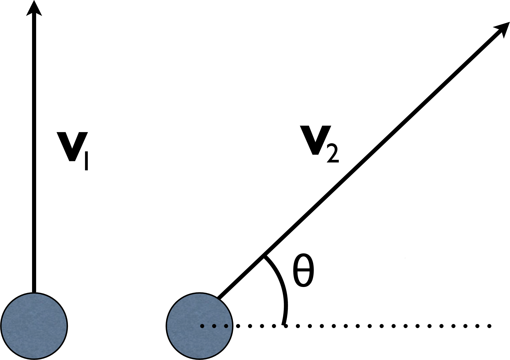

# {{ params_vars_title }}
A ball fired vertically at speed $v_1$ reaches a maximum height $h_1$.

## Part 1

At what speed must a second ball of the same mass be fired to reach the same maximal height if it is fired at an angle $\theta=$ {{ params_theta }}$^{\circ}$ above the horizontal (as shown in the figure)?
Assume air resistance is negligible.

### Answer Section

- {{ params_part1_ans1_value }}
- {{ params_part1_ans2_value }}
- {{ params_part1_ans3_value }}
- {{ params_part1_ans4_value }}
- {{ params_part1_ans5_value }}
- {{ params_part1_ans6_value }}

## Attribution

Problem is licensed under the [CC-BY-NC-SA 4.0 license](https://creativecommons.org/licenses/by-nc-sa/4.0/).  