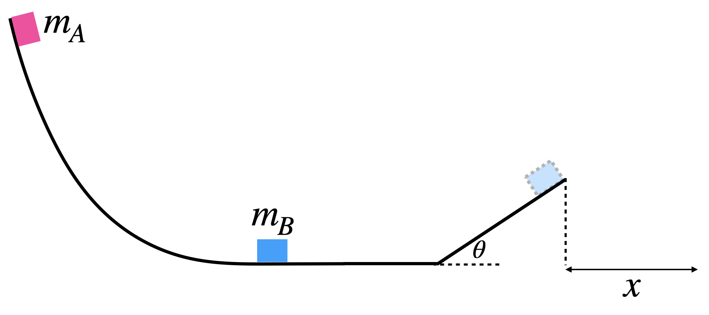

# {{ params_vars_title }}
A ski jump consists of a hill, a short flat section, and a ramp. The hill has height of ${{ params.hill_h }}$ $\rm{m}$ and the ramp has a height of ${{ params.ramp_h }}$ $\rm{m}$, making an angle of $\theta = {{ params.ramp_angle }}^\circ$ with the horizontal.

Block A of mass $m_A = {{ params_mA }}$ $\rm{kg}$ is released from rest at the top of the frictionless hill and slides down to the frictionless short flat section, where it undergoes a perfectly elastic collision with Block B of mass $m_B = {{params_mB }}$ $\rm{kg}$. This causes Block B to slide up the frictionless ramp and undergo projectile motion, before landing a horizontal distance $x$ away from the ramp at the same height as the short flat section.

## Part 1

What is the speed of Block B immediately after the perfectly elastic collision?

### Answer Section

Please enter in a numeric value in $\rm{m/s}$.

## Part 2

What is the horizontal distance that Block B travels after it goes off the ramp ($x$)?

### Answer Section

Please enter in a numeric value in $\rm{m}$.

## Attribution

Problem is licensed under the [CC-BY-NC-SA 4.0 license](https://creativecommons.org/licenses/by-nc-sa/4.0/).  