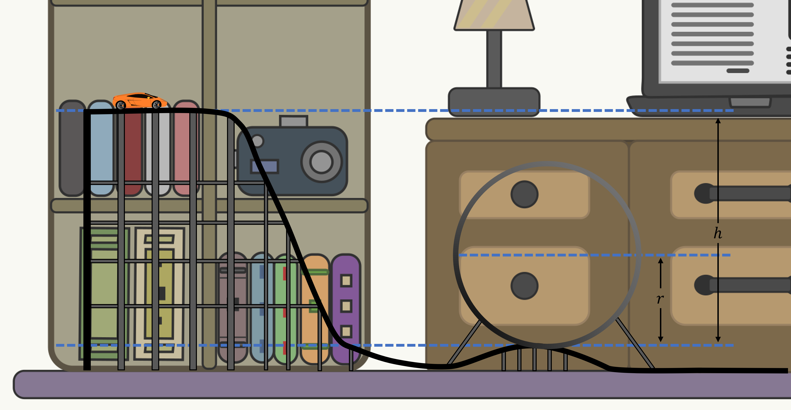

# {{ params_vars_title }}

A child creates a track to play with their hot wheels on. The hot wheel has a mass of $m = {{ params_m }} \ \rm{kg}$ and goes down an inclined plane which ends in a loop, before continuing onto a flat track. The loop has a radius of $r = {{ params_r }} \ \rm{m}$. The child has no clue how high the track must start for the car to make it fully through the loop without dropping.

## Part 1

Find the height the car must start at to fully pass through the loop.

### Answer Section

Please enter in a numeric value in {{ params_vars_units }}.

## Attribution

Problem is licensed under the [CC-BY-NC-SA 4.0 license](https://creativecommons.org/licenses/by-nc-sa/4.0/).  