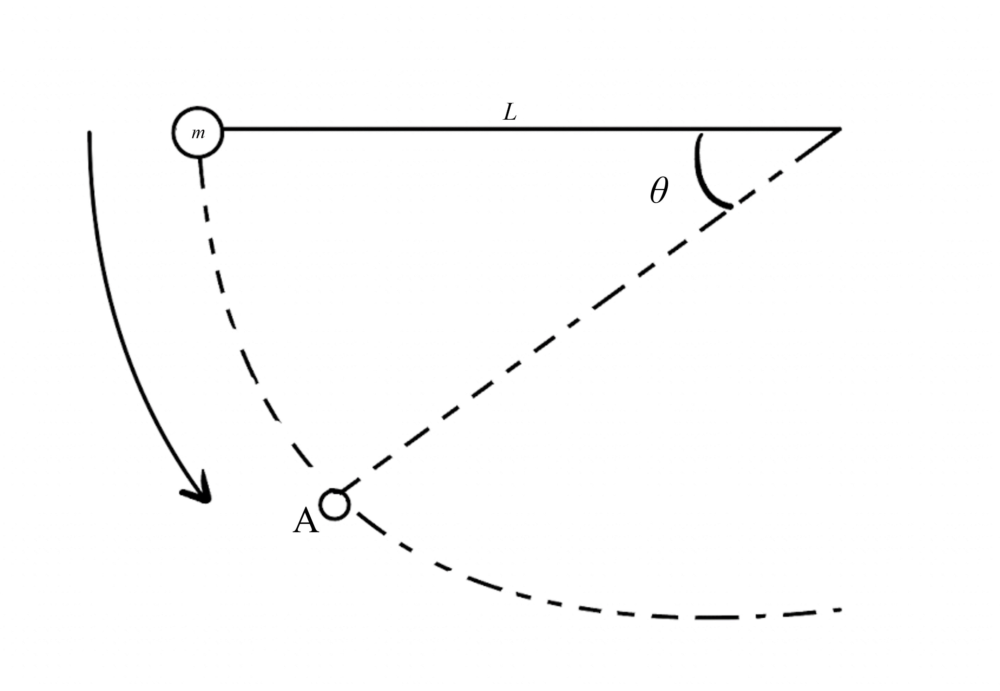

# {{ params_vars_title }}
{{params_mainText}}

## Part 1

{{params_part1Text}}

### Answer Section

Please enter in a numeric value in {{ params_vars_units_part1 }}.

## Part 2

{{params_part2Text}}

### Answer Section

Please enter in a numeric value in {{ params_vars_units_part2 }}.

## Attribution

Problem is licensed under the [CC-BY-NC-SA 4.0 license](https://creativecommons.org/licenses/by-nc-sa/4.0/).  