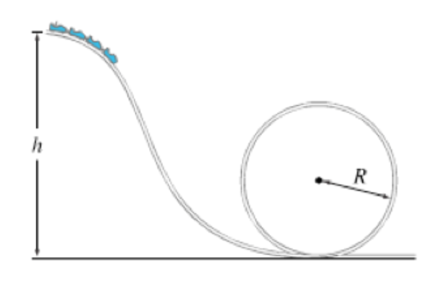

# {{ params_vars_title }}
A roller-coaster travels over a vertical, circular loop of radius $R = $ {{ params_r }} $m$.

## Part 1

If it travels without friction along the track, what is the minimum speed required at the bottom of the loop such that the roller-coaster remains in contact with the track at the top of the loop?

### Answer Section

- {{ params_part1_ans1_value }} {{ params_vars_units}}
- {{ params_part1_ans2_value }} {{ params_vars_units}}
- {{ params_part1_ans3_value }} {{ params_vars_units}}
- {{ params_part1_ans4_value }} {{ params_vars_units}}
- {{ params_part1_ans5_value }} {{ params_vars_units}}
- {{ params_part1_ans6_value }} {{ params_vars_units}}

## Attribution

Problem is licensed under the [CC-BY-NC-SA 4.0 license](https://creativecommons.org/licenses/by-nc-sa/4.0/).  