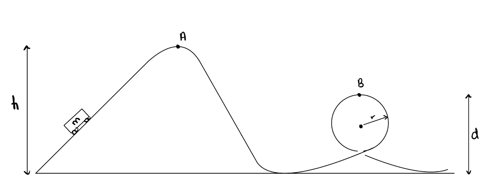

# {{ params_vars_title }}
A rollercoaster ride moves a car with a mass of ${{params_m}}\ \rm{kg}$ to point $A$ at a height $h = {{params_h}} \ \rm{m}$. At point $A$, the car is at rest, and then goes down the path through a loop of radius ${{params_r}} \ \rm{m}$. Point $B$ is at a height of ${{params_d}} \ \rm{m}$.

## Part 1

What is the maximum speed of the rollercoaster?

### Answer Section

Please enter in a numeric value in ${{ params_vars_units }}$.

## Part 2

What is the speed at point $B$?

### Answer Section

Please enter in a numeric value in ${{ params_vars_units }}$.

## Attribution

Problem is licensed under the [CC-BY-NC-SA 4.0 license](https://creativecommons.org/licenses/by-nc-sa/4.0/).  