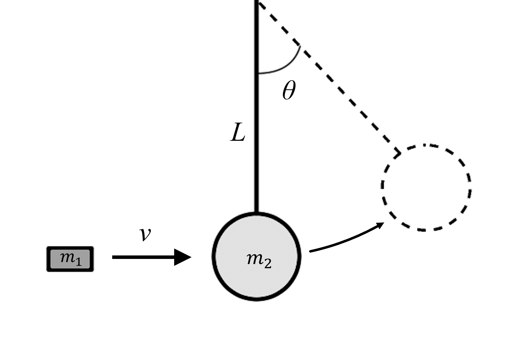

# {{ params_vars_title }}
A bullet of mass $m_1={{params_m1}} \ \rm{kg}$ is traveling at velocity $v={{params_v}} \ \rm{m/s}$.
It collides with a mass $m_2={{params_m2}} \ \rm{kg}$ hanging at rest on a rope of length $L={{params_L}} \ \rm{m}$.
Both masses combine and swing to an angle $\theta$.

## Part 1

What is this angle?

### Answer Section

Please enter in a numeric value in $^\circ$.

## Attribution

Problem is licensed under the [CC-BY-NC-SA 4.0 license](https://creativecommons.org/licenses/by-nc-sa/4.0/).  