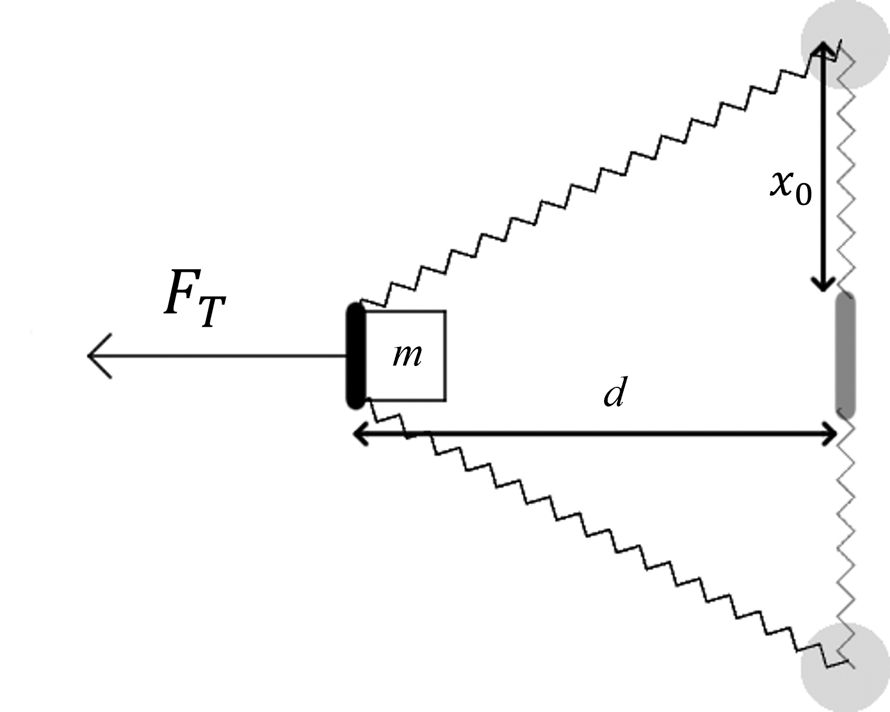

# {{ params_vars_title }}
A slingshot made of two springs with spring constant ${{params_K}} \ \rm{N/m}$ is loaded with a mass $m={{params_m}} \ \rm{kg}$.
When relaxed, the springs have a length $x_0={{params_x0}} \ \rm{m}$.
Using a rope, someone pulls the mass $d={{params_d}} \ \rm{m}$ from its rest state.

## Part 1

How much tension is in the rope?

### Answer Section

Please enter in a numeric value in $N$.

## Part 2

If the rope is cut, with what speed does the mass leave the slingshot?
Assume all the energy in the springs is transferred to the mass.

### Answer Section

Please enter in a numeric value in $m/s$.

## Attribution

Problem is licensed under the [CC-BY-NC-SA 4.0 license](https://creativecommons.org/licenses/by-nc-sa/4.0/).  