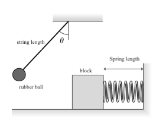

# {{ params.vars.title }}
A {{params.m_1}} $\rm{g}$ rubber ball is tied to a {{params.l}} meter long string and released from rest at angle $\theta$.
It swings down and at the very bottom has a perfectly elastic collision with a {{params.m_2}} $\rm{kg}$ block.
The block is resting on a frictionless surface and is connected to a {{params.spring}} cm long spring of spring constant
{{params.k}} $\rm{N/m}$.
After the collision, the spring compresses a maximum distance of {{params.x}} $\rm{cm}$.

## Part 1

From what angle was the rubber ball released?

### Answer Section

Please enter in a numeric value.

## Attribution

Problem is licensed under the [CC-BY-NC-SA 4.0 license](https://creativecommons.org/licenses/by-nc-sa/4.0/).  