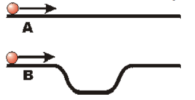

# {{ params.vars.title }}
Balls A and B are launched with the same initial velocity along a pair of tracks as shown in the figure.

## Part 1

Which ball reaches the end of the track first, if friction is neglected?

### Answer Section

- {{ params.part1.ans1.value }}
- {{ params.part1.ans2.value }}
- {{ params.part1.ans3.value }}
- {{ params.part1.ans4.value }}

## Attribution

Problem is licensed under the [CC-BY-NC-SA 4.0 license](https://creativecommons.org/licenses/by-nc-sa/4.0/).  