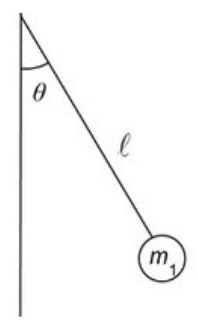

# {{ params.vars.title }}
The figure below shows a simple pendulum. The length of the string is $l$ and the bob has mass $m_1$.

## Question Text

If the mass is released from rest when $\theta = {{ params.theta }}^{\circ}$, at which values of $\theta$ does the mass have half of its maximum kinetic energy?

### Answer Section

Please enter in a numeric value in {{ params.vars.units }}.

## Attribution

Problem is licensed under the [CC-BY-NC-SA 4.0 license](https://creativecommons.org/licenses/by-nc-sa/4.0/).  