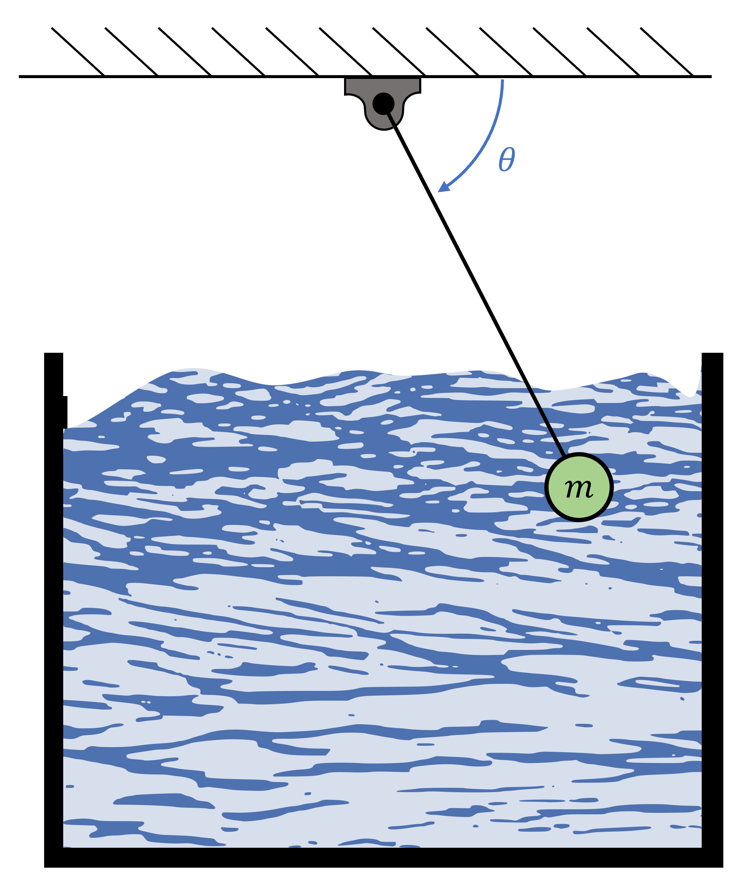
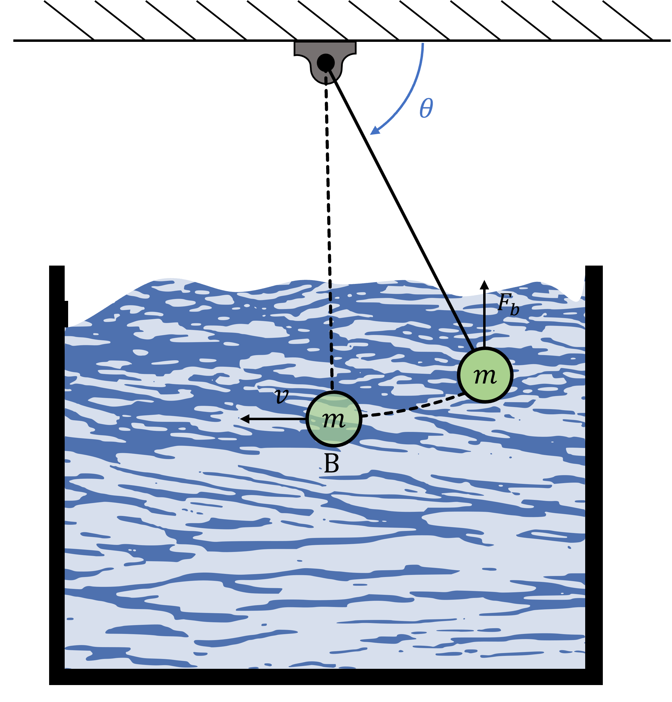

# Pendulum Kinetics
A pendulum submerged in a fluid with the bob initially held at an angle of $\theta^{\circ}$ degrees measured from below the horizontal, is released from rest as illustrated below.

## Part 1

If in addition to the tension in the string and weight of the bob, a buoyant force of constant magnitude and direction acts on the bob according to the equation; $F\_{b}=\rho g V$, where $\rho$ is the fluid density, $V$ is the volume of fluid displaced, and $g$ is the gravitational acceleration. Determine the work-done by the buoyant force on the bob when it reaches point B as shown below. 
$\theta = {{ params_theta }}^{\circ}$, $L = {{ params_l }} \ \rm{m}$, $V\_{bob} = {{ params_v }} \ \rm{m^3}$, $\rho = {{ params_p }}\ \rm{kg.m^{-3}}$.

### Answer Section

Please enter in a numeric value in $\rm{N.m}$.

## Part 2

Determine the speed of the bob at point B. 
$m = {{ params_m }} \ \rm{kg}$.

### Answer Section

Please enter in a numeric value in $m/s$.

## Part 3

Determine the maximum tension force in the string through the pendulum motion.

### Answer Section

Please enter in a numeric value in $N$.

## Part 4

Determine the centripetal force in the string at point B.

### Answer Section

Please enter in a numeric value in $N$.

## Attribution

Problem is licensed under the [CC-BY-NC-SA 4.0 license](https://creativecommons.org/licenses/by-nc-sa/4.0/).  